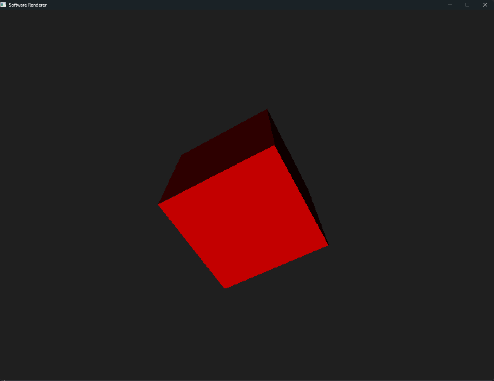

# SOFTWARE RENDERED GAME ENGINE
A software renderer made using C and SDL3. Inspired by the original quake engine which relied on software rendering.<br/>
This engine works by writing unsigned int 32 color values to a framebuffer which is then presented to the screen as a texture.



## Building
This project uses a makefile for build and compilation management. To build the project:
``` make
make build
```
This will create a folder 'out' that contains the compiled executable